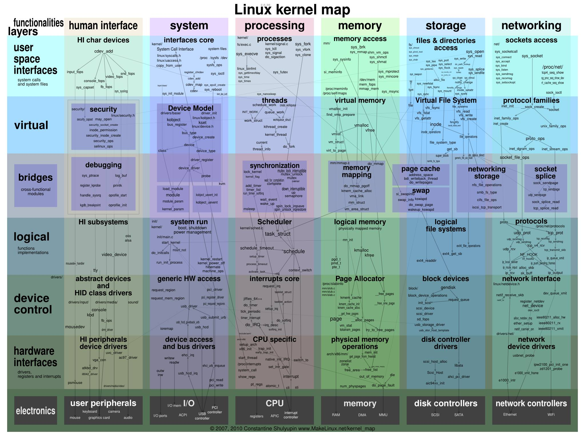

# 출처:
- https://makelinux.github.io/kernel/map/

# 유튜브 영상
- [커널 지도 ) 최고  This is How The Kernel Works - An Interactive Map of the Kernel and its Systems. | SavvyNik](https://youtu.be/BW60nfDU-Os?si=lRdaPXJuwS3NUTT2)

# LinuxKernel Source(ver 7.0 미리 살펴보자)
- https://elixir.bootlin.com/linux/v7.0-rc4/source/tools/perf/util/mutex.h

# 이미지

